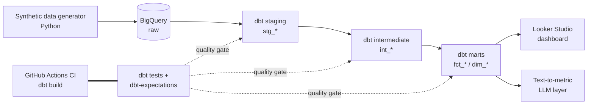

# RevenueGrain

**A tested, documented dbt + BigQuery analytics warehouse for B2B SaaS revenue and product-usage intelligence.**

RevenueGrain turns messy operational SaaS data — subscriptions, product usage, and support tickets — into clean, business-ready metrics: MRR, net revenue retention, churn, expansion, feature adoption, and per-account health scores. Every model is version-controlled, documented, and gated behind a data-quality test suite that runs in CI on every change.

> The name is a nod to *grain* — the level of detail a fact table is modeled at. Getting the grain right is the first thing analytics engineering gets you to care about, and it's the backbone of this project.

---

## Why this project exists

Most analytics work breaks silently: a duplicated join, a late-arriving event, a metric that quietly drifts. RevenueGrain treats **data quality as a first-class engineering concern**, not an afterthought — carrying a QA/SDET testing discipline into the analytics-engineering layer.

The result is a warehouse where you can trust the number on the dashboard, because the pipeline refuses to ship a number it can't defend.

---

## What it does

- Ingests synthetic-but-realistic SaaS operational data (accounts, subscriptions, daily usage events, support tickets) — deliberately seeded with duplicates, nulls, and late-arriving rows.
- Transforms it through a layered dbt project (`staging → intermediate → marts`) into a documented semantic layer of business metrics.
- Enforces a **data-quality gate**: schema tests, distribution/range tests, reconciliation tests, and source freshness — all run in CI and block a merge on failure.
- Surfaces the metrics in a **Looker Studio** dashboard for revenue and customer-success stakeholders.
- Ships a lightweight **text-to-metric** layer: ask a question in plain English, get SQL generated against the semantic layer.

---

## Architecture



---

## Data model

| Layer | Purpose | Examples |
|-------|---------|----------|
| **Staging** (`stg_`) | 1:1 with sources, light cleaning, typed and renamed | `stg_accounts`, `stg_subscriptions`, `stg_usage_events`, `stg_tickets` |
| **Intermediate** (`int_`) | Reusable business logic, fan-out resolution | `int_subscription_monthly`, `int_usage_daily_rollup`, `int_account_lifecycle` |
| **Marts** (`fct_`/`dim_`) | Business-ready facts and dimensions at a defined grain | `fct_mrr_monthly`, `fct_account_health`, `dim_accounts` |

### Headline metrics

- **MRR** and MRR movement (new / expansion / contraction / churn)
- **Net Revenue Retention (NRR)** and **Gross Revenue Retention**
- **Logo churn** and **revenue churn** by cohort
- **Feature adoption rate** per account and segment
- **Account health score** — a composite of usage trend, ticket volume, and payment status

---

## Data quality & testing

This is the core of the project. Beyond dbt's built-in `unique` / `not_null` / `relationships`:

- **Distribution & range tests** (`dbt-expectations`) — e.g. MRR is never negative, churn rate stays within `[0, 1]`, health score within `[0, 100]`.
- **Reconciliation tests** (custom generic tests) — e.g. the sum of segment-level MRR equals total MRR; no account is both `churned` and `active` in the same month.
- **Source freshness** — flags stale upstream data before it silently corrupts a mart.
- **Data contracts** — enforced schemas on staging models so an upstream shape change fails loudly instead of leaking downstream.

Every source model has a documented contract describing its grain, its keys, and what is guaranteed about it. See [`docs/data_quality.md`](docs/data_quality.md) for the full test inventory and the rationale behind each check — including the gaps that are knowingly *not* covered and why.

---

## CI/CD

A GitHub Actions workflow runs `dbt build` (models **and** tests) against a BigQuery CI dataset on every pull request. A failing test blocks the merge — the same gating discipline a QA pipeline applies to application code, applied here to data.

```
.github/workflows/dbt_ci.yml   # runs dbt build + tests on every PR
```

---

## Text-to-metric layer

A small module that takes a natural-language question ("what was net revenue retention for enterprise accounts last quarter?"), maps it to the semantic layer, and generates the corresponding SQL. It is intentionally scoped — a demonstration of the enterprise-intelligence direction, layered *on top of* a trustworthy metrics foundation rather than in place of one.

---

## Tech stack

| Concern | Tool |
|---------|------|
| Warehouse | Google BigQuery |
| Transformation | dbt (Core) |
| Testing | dbt tests, `dbt-expectations`, custom generic tests |
| CI | GitHub Actions |
| BI / dashboard | Looker Studio |
| Data generation | Python (`faker`, `pandas`) |
| AI layer | Claude API (text-to-metric) |

---

## Getting started

### Prerequisites

- A GCP project with BigQuery enabled and a service-account key
- Python 3.11+
- dbt-bigquery (`pip install dbt-bigquery`)

### Setup

```bash
# 1. Clone and install
git clone https://github.com/sajansshergill/revenuegrain.git
cd revenuegrain
pip install -r requirements.txt

# 2. Generate and load synthetic data into BigQuery raw
python scripts/generate_data.py --project YOUR_GCP_PROJECT --dataset raw

# 3. Configure your dbt profile (see profiles.example.yml), then:
dbt deps
dbt build          # runs all models AND tests
dbt docs generate  # builds the lineage graph + docs site
dbt docs serve
```

The `dbt docs` lineage graph is worth generating — it's the clearest visual of how raw data flows to trusted metrics.

---

## Project structure

```
revenuegrain/
│
├── README.md
├── LICENSE
├── requirements.txt                          # Python deps (dbt-bigquery, faker, pandas, anthropic)
├── .gitignore
├── .env.example                              # template for GCP + API credentials
│
├── dbt_project.yml                           # dbt project config: paths, model materializations
├── packages.yml                              # dbt-utils, dbt-expectations
├── profiles.example.yml                      # BigQuery connection template (dev + ci targets)
│
├── .github/
│   └── workflows/
│       └── dbt_ci.yml                         # runs `dbt build` (models + tests) on every PR
│
├── scripts/                                   # data generation & loading (outside dbt)
│   ├── generate_data.py                       # synthetic SaaS data, seeded with nulls/dupes/late rows
│   ├── load_to_bigquery.py                    # loads generated CSVs into the BigQuery `raw` dataset
│   └── seed_config.yml                        # row counts, date ranges, messiness knobs
│
├── seeds/                                      # small static reference data (version-controlled)
│   ├── seed_plan_tiers.csv                    # plan → tier, list price
│   └── seed_feature_catalog.csv               # feature keys → display names, category
│
├── models/
│   ├── staging/                               # 1:1 with sources — typed, renamed, lightly cleaned
│   │   ├── _staging__sources.yml              # source definitions + freshness thresholds
│   │   ├── _staging__models.yml               # column tests, descriptions, data contracts
│   │   ├── stg_accounts.sql
│   │   ├── stg_subscriptions.sql
│   │   ├── stg_usage_events.sql
│   │   └── stg_tickets.sql
│   │
│   ├── intermediate/                          # reusable business logic, fan-out resolved
│   │   ├── _intermediate__models.yml
│   │   ├── int_subscription_monthly.sql       # one row per account per month
│   │   ├── int_mrr_movements.sql              # new / expansion / contraction / churn deltas
│   │   ├── int_usage_daily_rollup.sql
│   │   └── int_account_lifecycle.sql          # signup → active → churned state per account
│   │
│   └── marts/                                 # business-ready, defined grain, tested
│       ├── core/
│       │   ├── _core__models.yml
│       │   ├── dim_accounts.sql
│       │   ├── dim_dates.sql
│       │   └── fct_subscription_events.sql
│       ├── finance/
│       │   ├── _finance__models.yml
│       │   ├── fct_mrr_monthly.sql            # MRR + movement, grain: account × month
│       │   └── fct_revenue_retention.sql      # NRR / GRR by cohort
│       └── customer_success/
│           ├── _customer_success__models.yml
│           ├── fct_account_health.sql         # composite health score, grain: account × month
│           └── fct_feature_adoption.sql
│
├── tests/                                      # data-quality tests (the differentiator)
│   ├── generic/                               # reusable, parameterized tests
│   │   ├── test_positive_value.sql            # e.g. MRR never negative
│   │   └── test_rate_between_zero_and_one.sql # e.g. churn rate ∈ [0,1]
│   └── singular/                              # specific business-rule assertions
│       ├── assert_segment_mrr_reconciles_to_total.sql
│       └── assert_no_active_and_churned_same_month.sql
│
├── macros/                                     # reusable SQL
│   ├── cents_to_dollars.sql
│   ├── generate_schema_name.sql               # clean schema naming for dev/ci/prod
│   └── get_active_months.sql
│
├── snapshots/
│   └── accounts_snapshot.sql                  # SCD-2 history on plan/status changes
│
├── analyses/                                   # ad-hoc SQL, compiled but not materialized
│   └── mrr_waterfall_exploration.sql
│
├── text_to_metric/                             # lightweight AI / enterprise-intelligence layer
│   ├── __init__.py
│   ├── semantic_layer.yml                      # metric definitions the LLM maps questions to
│   ├── query_builder.py                        # NL question → SQL against the semantic layer
│   ├── llm_client.py                           # Claude API wrapper
│   └── app.py                                   # minimal Streamlit / CLI entry point
│
└── docs/
    ├── architecture.md                         # data flow, grain decisions, design rationale
    ├── data_contracts.md                       # source schemas + guarantees
    ├── data_quality.md                         # full test inventory + honest gaps
    └── metrics_glossary.md                     # plain-language metric definitions
```

---

## Roadmap

- [ ] Add cohort-retention visualization to the dashboard
- [ ] Incremental models for `fct_mrr_monthly` to demonstrate scale patterns
- [ ] Snapshot slowly-changing dimensions on `dim_accounts`
- [ ] Expand the text-to-metric layer with an anomaly-narration mode

---

## Author

**Sajan Shergill** — QA/SDET engineer moving into data & analytics engineering. I build data products with the test coverage most pipelines skip.

- Portfolio: [sajansshergill.github.io](https://sajansshergill.github.io)
- LinkedIn: [linkedin.com/in/sajanshergill](https://linkedin.com/in/sajanshergill)
